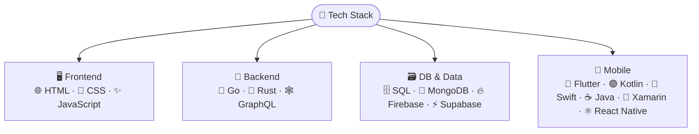
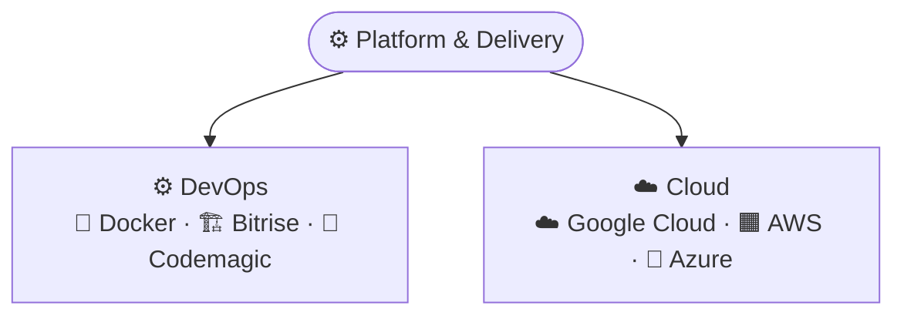
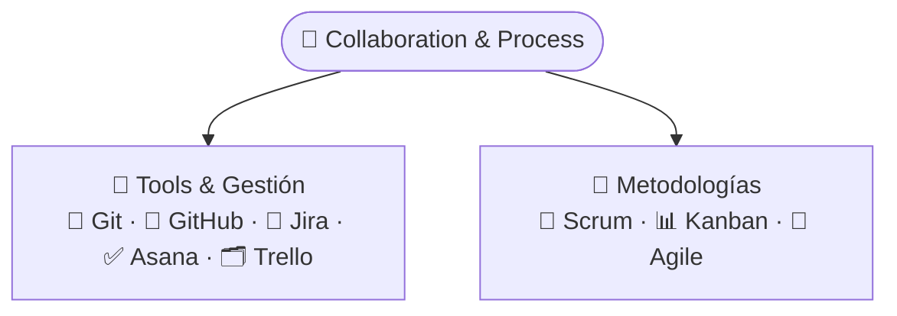
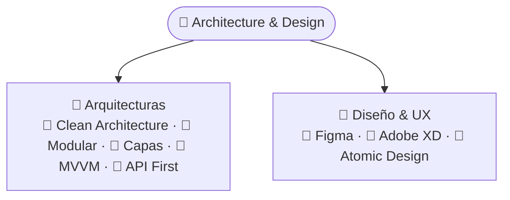
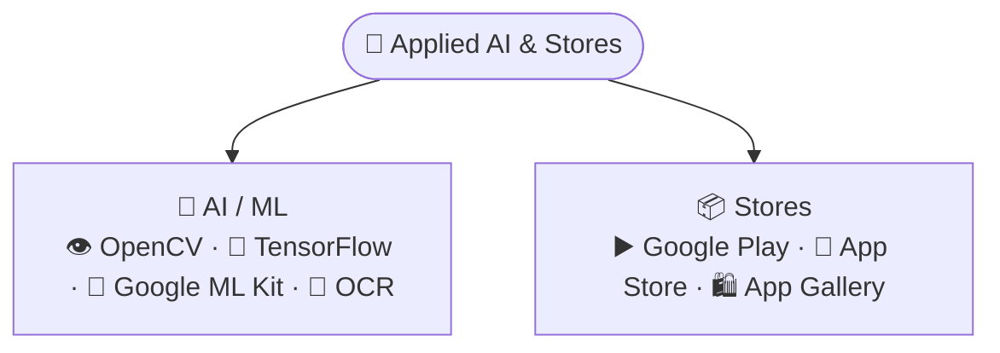
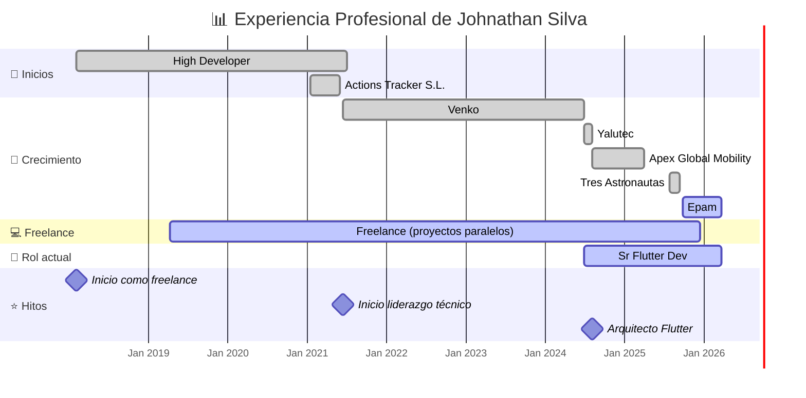

  

<h1 align="center">Hola 👋, soy Johnathan Yesid Silva Parra</h1>
<h3 align="center">🇨🇴 Mobile Developer | Flutter Expert | Technical Leader</h3>

  
  
  
  

  

---

## 🧾 Sobre mí

Desarrollador móvil con más de 7 años de experiencia en la creación de apps nativas y multiplataforma, desempeñando roles técnicos y de liderazgo. Apasionado por las arquitecturas limpias, automatización y entrega continua. Me encanta construir soluciones eficientes que impacten usuarios reales.

- 📍 Floridablanca, Colombia  
- 🎯 Especializado en Flutter, Kotlin, Swift  
- 🚀 Technical Leader en proyectos de alto impacto  
- 🧠 Siempre aprendiendo: React Native, Animaciones, UI/UX

---

### 🧰 Tech Stack

```mermaid
flowchart TB
  A([🧰 Tech Stack])

  A --> FE["🖥️ Frontend<br/>🌐 HTML · 🎨 CSS · ✨ JavaScript"]
  A --> BE["🧠 Backend<br/>🐹 Go · 🦀 Rust · 🕸️ GraphQL"]
  A --> DB["🗃️ DB & Data<br/>🗄️ SQL · 🍃 MongoDB · 🔥 Firebase · ⚡ Supabase"]
  A --> MO["📱 Mobile<br/>💙 Flutter · 🟣 Kotlin · 🧡 Swift · ☕ Java · 🧩 Xamarin · ⚛️ React Native"]
```

```mermaid
flowchart TB
  A([⚙️ Platform & Delivery])

  A --> DO["⚙️ DevOps<br/>🐳 Docker · 🏗️ Bitrise · 🤖 Codemagic"]
  A --> CL["☁️ Cloud<br/>☁️ Google Cloud · 🟧 AWS · 🔷 Azure"]
```

```mermaid
flowchart TB
  A([🧰 Collaboration & Process])

  A --> TL["🧰 Tools & Gestión<br/>🔧 Git · 🐙 GitHub · 📌 Jira · ✅ Asana · 🗂️ Trello"]
  A --> ME["🔁 Metodologías<br/>🔄 Scrum · 📊 Kanban · 🚀 Agile"]
```

```mermaid
flowchart TB
  A([🧱 Architecture & Design])

  A --> AR["🧱 Arquitecturas<br/>🧼 Clean Architecture · 🧩 Modular · 🧱 Capas · 🔀 MVVM · 🔌 API First"]
  A --> UX["🎨 Diseño & UX<br/>🧩 Figma · 🧿 Adobe XD · 🧱 Atomic Design"]
```

```mermaid
flowchart TB
  A([🧠 Applied AI & Stores])

  A --> AI["🧠 AI / ML<br/>👁️ OpenCV · 🧠 TensorFlow · 🤖 Google ML Kit · 🔎 OCR"]
  A --> ST["📦 Stores<br/>▶️ Google Play · 🍎 App Store · 🛍️ App Gallery"]
```
---

## 💼 Experiencia Laboral

```mermaid
gantt
  title 📊 Experiencia Profesional de Johnathan Silva
  dateFormat  YYYY-MM-DD
  axisFormat  %b %Y

  section 🏁 Inicios
  High Developer       :done, 2018-02-01, 2021-06-30
  Actions Tracker S.L. :done, 2021-01-14, 2021-05-30

  section 🚀 Crecimiento
  Venko               :done, 2021-06-14, 2024-06-24
  Yalutec             :done, 2024-06-24, 2024-07-31
  Apex Global Mobility:done, 2024-08-01, 2025-03-31
  Tres Astronautas    :done, 2025-07-24, 2025-09-10
  Epam                :active, 2025-09-22, 2026-03-20

  section 💻 Freelance
  Freelance (proyectos paralelos) :active, 2019-04-08, 2025-12-10

  section 🧠 Rol actual
  Sr Flutter Dev :active, 2024-06-24, 2026-03-20

  section ⭐ Hitos
  Inicio como freelance     :milestone, 2018-02-01, 0d
  Inicio liderazgo técnico  :milestone, 2021-06-14, 0d
  Arquitecto Flutter        :milestone, 2024-08-01, 0d
```
---

## 📫 Contacto

---
