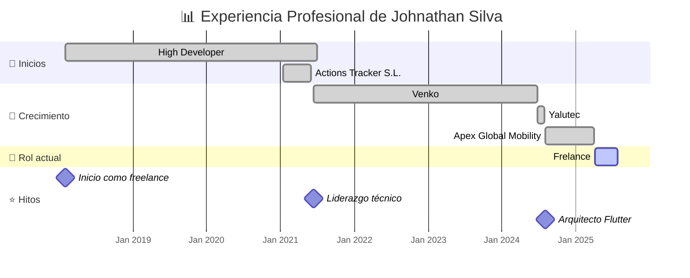

  

<h1 align="center">Hola 👋, soy Johnathan Yesid Silva Parra</h1>
<h3 align="center">🇨🇴 Mobile Developer | Flutter Expert | Technical Leader</h3>

  
  
  
  

<!-- 
  
 -->

---

## 🧾 Sobre mí

Desarrollador móvil con más de 6 años de experiencia en la creación de apps nativas y multiplataforma, desempeñando roles técnicos y de liderazgo. Apasionado por las arquitecturas limpias, automatización y entrega continua. Me encanta construir soluciones eficientes que impacten usuarios reales.

- 📍 Floridablanca, Colombia  
- 🎯 Especializado en Flutter, Kotlin, Swift  
- 🚀 Technical Leader en proyectos de alto impacto  
- 🧠 Siempre aprendiendo: React Native, Animaciones, UI/UX

---

### 🧰 Tech Stack

```mermaid
graph TD
  A[Tech Stack Principal] --> B[Frontend]
  A --> C[Backend & Data]
  A --> D[Mobile]
  A --> E[DevOps, Tools & Gestión]
  A --> F[Diseño y UX]

  B --> B1[HTML]
  B --> B2[CSS]
  B --> B3[JavaScript - Básico]

  C --> C1[GraphQL - Avanzado]
  C --> C2[SQL - Avanzado]
  C --> C3[MongoDB - Intermedio]
  C --> C4[Firebase - Experto]
  C --> C5[Supabase - Básico]

  D --> D1[Flutter - Master]
  D --> D2[Kotlin - Avanzado]
  D --> D3[Swift - Avanzado]
  D --> D4[Java - Avanzado]
  D --> D5[Xamarin Forms - Intermedio]
  D --> D6[React Native - Básico]

  E --> E1[Git - Experto]
  E --> E2[GitHub - Avanzado]
  E --> E3[Bitrise - Avanzado]
  E --> E4[Docker - Básico]
  E --> E5[Google Cloud - Experto]
  E --> E6[AWS y Azure - Intermedio]
  E --> E7[CI/CD Tools]

  E --> E8[Jira - Avanzado]
  E --> E9[Asana - Avanzado]
  E --> E10[Trello - Avanzado]
  E --> E11[Scrum / Kanban]

  F --> F1[Figma - Master]
  F --> F2[Adobe XD - Avanzado]
  F --> F3[Atomic Design - Avanzado]

  %% CLASS ASSIGNMENTS
  class B1,B2,B3,C5,D6,E4 classBasico;
  class C3,D5,E6 classIntermedio;
  class C1,C2,D2,D3,D4,E2,E3,E8,E9,E10,F2,F3 classAvanzado;
  class C4,D1,E1,E5,F1 classExperto;
  class E11 classAgile;

  %% COLOR DEFINITIONS
  classDef classBasico fill:#d0ebff,stroke:#228be6,stroke-width:1px;
  classDef classIntermedio fill:#fff3bf,stroke:#f08c00,stroke-width:1px;
  classDef classAvanzado fill:#ffe066,stroke:#fab005,stroke-width:1px;
  classDef classExperto fill:#d3f9d8,stroke:#2b8a3e,stroke-width:1px;
  classDef classAgile fill:#e0c3fc,stroke:#9b59b6,stroke-width:1px;
```
### 🖥️ Frontend  
  
  

---

### 🗄️ Backend & Data  
  
  
  
  

---

### 📱 Mobile  
  
  
  
  
  

---

### ⚙️ DevOps, Tools & Gestión  
  
  
  
  
  
  
  
  
  
  
  
  

---

### 🎨 Diseño & UX  
  
  

---

### 🧠 AI / ML  
  
  
  

---

### 📦 Stores  
  
  

---

## 💼 Experiencia Laboral

```mermaid
gantt
  title 📊 Experiencia Profesional de Johnathan Silva
  dateFormat  YYYY-MM-DD
  axisFormat  %b %Y

  section 🏁 Inicios
  High Developer         :done, hd, 2018-02-01, 2021-06-30
  Actions Tracker S.L.   :done, ats, 2021-01-14, 2021-05-30

  section 🚀 Crecimiento
  Venko                 :done, venko, 2021-06-14, 2024-06-24
  Yalutec               :done, yalutec, 2024-06-24, 2024-07-31
  Apex Global Mobility  :done, apex, 2024-08-01, 2025-03-31

  section 🧠 Rol actual
  Frelance :active, frelance, 2025-04-07, 2025-07-26

  section ⭐ Hitos
  Inicio como freelance :milestone, m1, 2018-02-01, 0d
  Liderazgo técnico     :milestone, m2, 2021-06-14, 0d
  Arquitecto Flutter    :milestone, m3, 2024-08-01, 0d
```

---

## 📈 Stats GitHub

  
   
  
   
  

---

## 📫 Contacto

---
